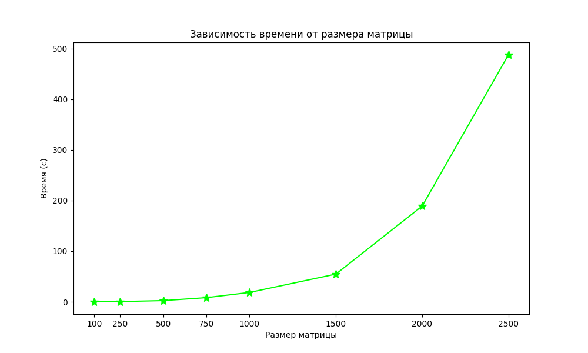

# Лабораторая работа №1
Выполнила студентка группы 6313-100503D Маслова Алена

## Задание
Написать программу на языке C/C++ для перемножения двух матриц.
Исходные данные: файл(ы) содержащие значения исходных матриц.
Выходные данные: файл со значениями результирующей матрицы, время выполнения, объем задачи. Обязательна автоматизированная верификация результатов вычислений с помощью сторонних библиотек или стороннего ПО.

## Характеристики ЭВМ
1) Процессор - 11th Gen Intel(R) Core(TM) i3-1115G4 3.00GHz 
2) Оперативная память - 8 ГБ
3) Тип системы - 64-разрядная операционная система, процессор x64
4) Видеокарта - Intel(R) UHD Graphics

## Содержание:
1) `lab1.cpp` - модуль работы с матрицами: генерирование и запись их в файлы, перемножение, запись результатов.
2) `check.py` - проверка результатов и построение графика.
3) `matrix` - хранит сгенерированнные матрицы и результат их перемножения.
4) `result.txt` - хранит время перемножения матриц
5) `grafic.png` - график.
6) `check.txt` - результаты проверки с помощью Python.

## График
В результате проведения лабораторной работы была построена следующая зависимость времени выполнения от количества элементов

## Вывод
При последовательном выполнении подсчета произведения двух матриц, время увеличивается с экспоненциальной зависимостью от количества элементов