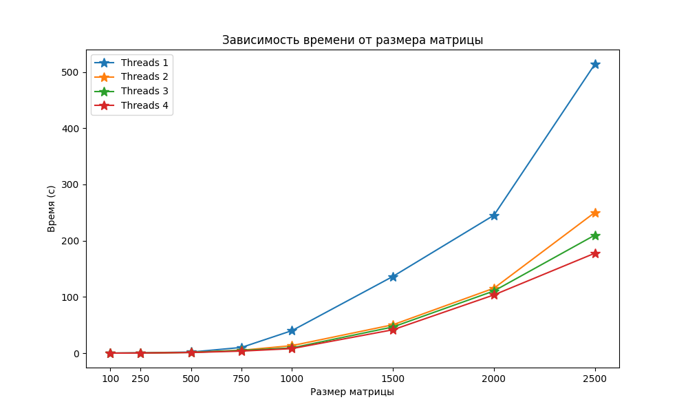

# Лабораторная работа №2
Выполнила студентка группы 6313-100503D Маслова Алена

## Задание
Модифицировать программу из л/р №1 для параллельной работы по технологии OpenMP

## Характеристики ЭВМ
1) Процессор - 11th Gen Intel(R) Core(TM) i3-1115G4 3.00GHz 
2) Оперативная память - 8 ГБ
3) Тип системы - 64-разрядная операционная система, процессор x64
4) Видеокарта - Intel(R) UHD Graphics

## Содержание:
1) `lab2.cpp` - модуль работы с матрицами: генерирование и запись их в файлы, перемножение, запись результатов.
2) `check.py` - проверка результатов и построение графика.
3) `matrix` - хранит сгенерированнные матрицы и результат их перемножения.
4) `result` - хранит время перемножения матриц
5) `grafic.png` - график.
6) `check.txt` - результаты проверки с помощью Python.

## График
В результате проведения лабораторной работы была построена следующая зависимость времени выполнения от количества элементов

## Вывод
OpenMP позволяет ускорить исследуемую операцию. Каждый поток работает над своей частью результирующей матрицы, что позволяет эффективнее использовать вычислительные ресурсы и уменьшить время выполнения операции умножения. Чем больше потоков потоков, тем лучше результат.