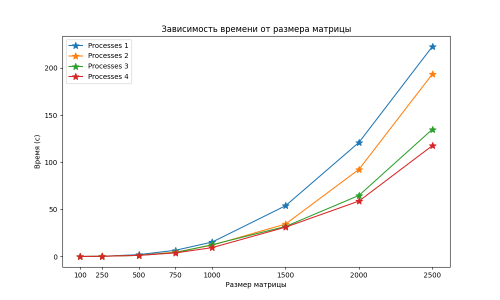
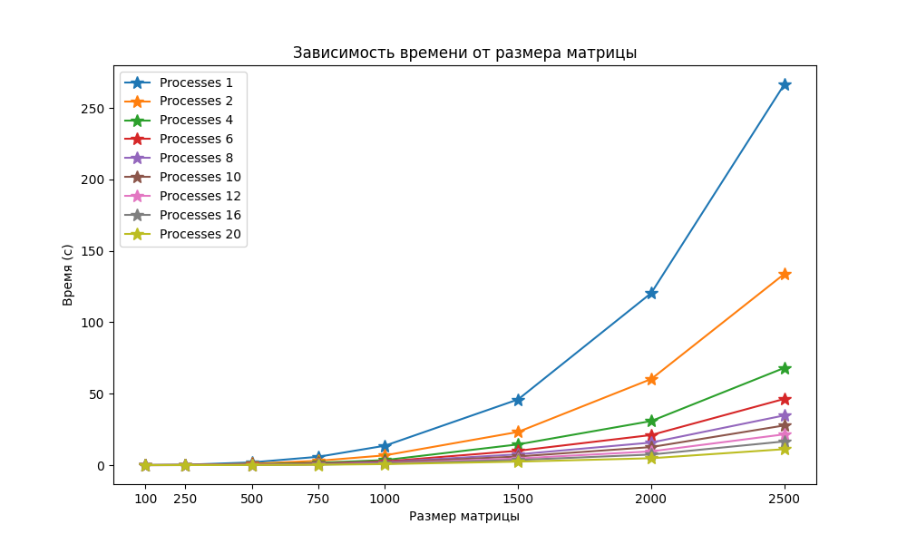

# Лабораторная работа №3
Выполнила студентка группы 6313-100503D Маслова Алена

## Задание
Модифицировать программу из л/р №1 для параллельной работы по технологии MPI. Одну из параллельных версий программ (на выбор, но целесообразнее всего MPI) необходимо также запустить на суперкомпьютере «Сергей Королёв».

## Характеристики ЭВМ
1) Процессор - 11th Gen Intel(R) Core(TM) i3-1115G4 3.00GHz 
2) Оперативная память - 8 ГБ
3) Тип системы - 64-разрядная операционная система, процессор x64
4) Видеокарта - Intel(R) UHD Graphics

## Содержание:
1) `lab3.cpp` - модуль работы с матрицами: генерирование и запись их в файлы, перемножение, запись результатов.
2) `check.py` - проверка результатов и построение графика.
3) `matrix` - хранит сгенерированнные матрицы и результат их перемножения.
4) `result` - хранит время перемножения матриц
5) `grafic.png` - график.
6) `check.txt` - результаты проверки с помощью Python.
7) `supercomp.cpp` - создание и перемножение матриц с поддержкой MPI на суперкомпьютере «Сергей Королёв».
8) `run_mpi_matrix` - вспомогательный файл для запуска основного файла lab3.cc.
9) `supercomp` - результаты перемножения матриц на суперкомпьютере "Сергей Королев"
10) `grafic_supercomp.png` - график для суперкомпьютера "Сергей Королев"

## График на ноутбуке
В результате проведения лабораторной работы была построена следующая зависимость времени выполнения от количества элементов

## График на суперкомпьютере "Сергей Королев"

## Вывод
В ходе выполнения лабораторной работы была реализована программа для параллельного умножения матриц с использованием технологии MPI. Программа успешно выполняет умножение матриц различных размеров, распределяя вычисления между несколькими процессами. Также данная лабораторная работа выполнялась, помимо ноутбука, на суперкомпьютере "Сергей Королев", где были выявлены хорошие результаты. 